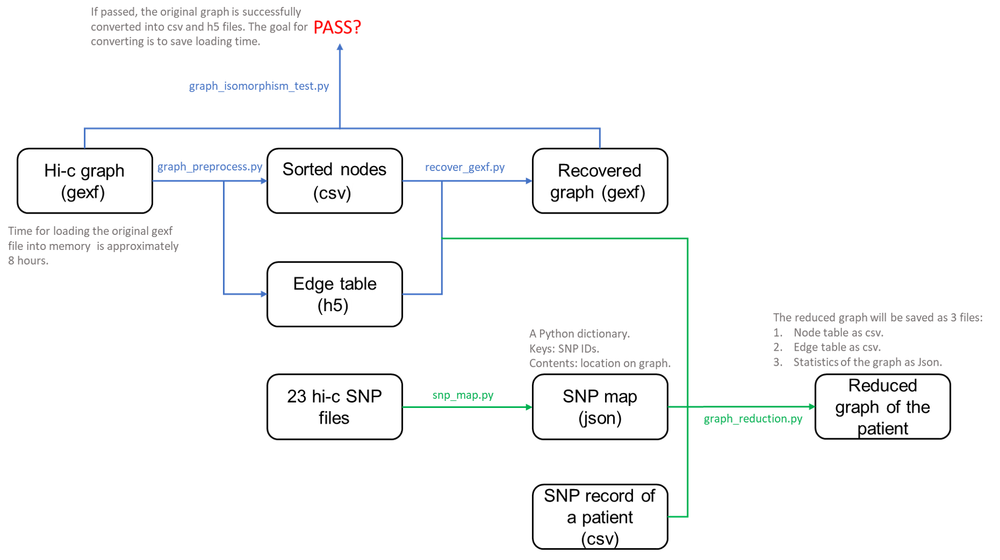
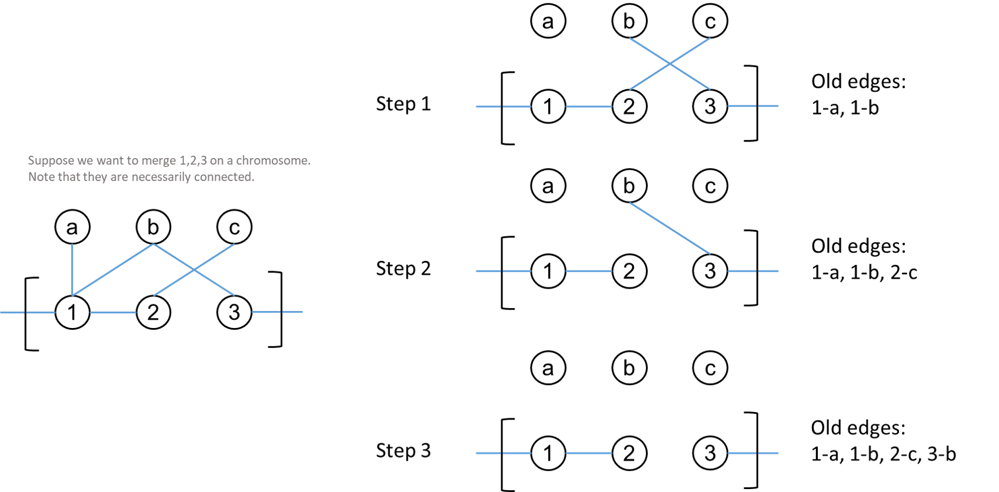
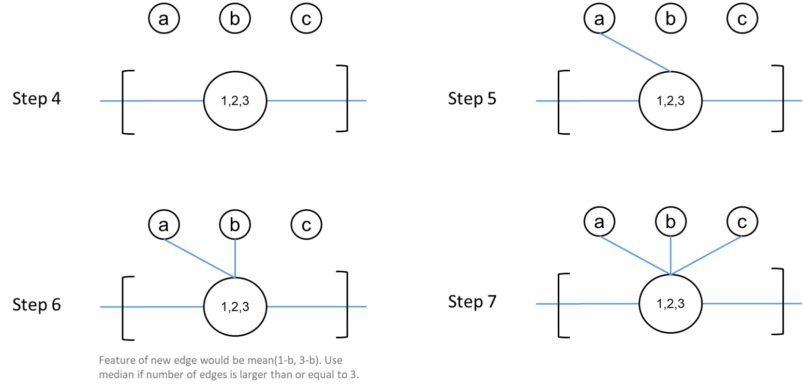

# The Hi-c project
Developing notes for the hi-c project. Below is the flowchart of the codes for graph reduction:  

   <p align="center">
   
   </p>

## Pre-process
The original graph is a huge graph, the corresponding gexf file is 35.5GB, and the loading time is 8 hours. We need to find a way to optimize this. 
1. graph_preprocess.py: generates an .h5 file containing all the information of the graph and a .csv file containing the nodes sorted by their order in chromosomes.
2. graph_load_time_test.py: tests the time to load the orignal graph from the .h5 and .csv file. If it takes less time, we are going to use these files instead of the original .gexf file in the future.
3. recover_gexf.py: recover the .h5 file and the .csv file to .gexf file.
4. graph_isomorphism_test: test if the .gexf file generated by recover_gexf file is the same as the original file.
5. snp_map.py: generate a .json file which contains a dictionary. The keys are node ids, and the contents are the locations of the nodes.

## Steps to generate a reduced graph for a single patient
1. Load the original hi-c graph. (Only loading the edge table and node table)
2. Load the csv of the sorted nodes as a dataframe.
3. Load the SNP location map generated by snp_map.py.
4. Load the SNPs of the patient.
5. Compute the list of lists of nodes to merge.
6. Apply the merge method to the nodes to merge. 

Note: it is very important that the node ids in the graph are consistent with the node ids in the csv file and the SNP map!

### The merge method
The steps of the ```merge``` method are shown in following figures. Basically, for each node to merge, we get the edges connected to them. In the mean time, the target nodes are computed by taking the set of the target nodes:

   <p align="center">
   
   </p>

Then, for each target node, compute the new edge for the merged node. Note that the edge attributes are computed by the median of edge attributes before merging. Use mean if there are only 2 edges that are merged:

   <p align="center">
   
   </p>

## Graph neural network for classification
